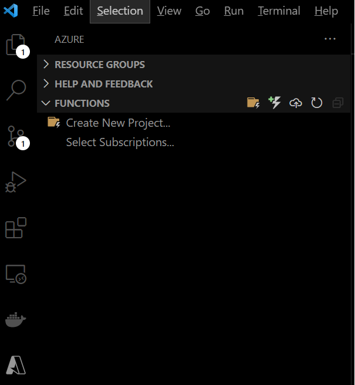
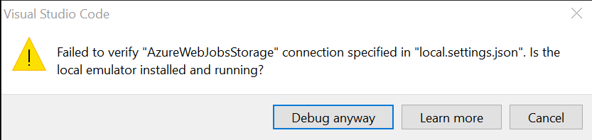
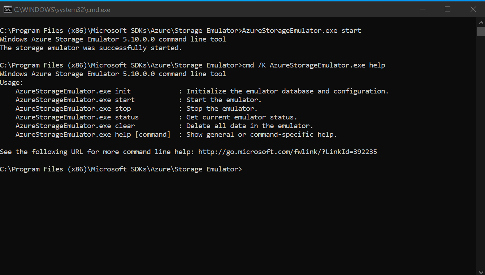
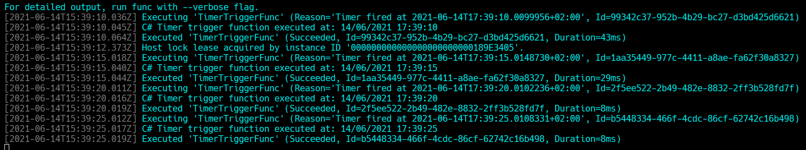

# Azure Function Series: build .NET Core 3.1 function

## Hashtags

dotnet, azure, function, serverless

In these days the usage of Azure Function is increasing constantly. Azure Function is an amazing tool that u can use in many different real-world scenario such as exposing a lightweight REST-API, scheduling some process, respond to certain events and so on. With this in mind I decided to make a series about them and this is the first article of it.
This will be a practical series: I'll guide you in a step-by-step process in order to make u more confortable at writing, testing and finally migrating a timer triggered Azure Function from .NET Core 3.1 LTS (in process worker) to [.NET 5](https://docs.microsoft.com/en-us/azure/azure-functions/dotnet-isolated-process-guide) (isolated worker process).  
As always if u get in trouble in following the process you can find all the code of this blog post in "start" folder of my GitHub repo that u can find [here](https://github.com/ivan-pesenti/azure-function-series)

## Software requirements

In order to follow this tutorial your machine must have:

- Visual Studio Code: this is our IDE for this demo
- [Azure Functions](https://marketplace.visualstudio.com/items?itemName=ms-azuretools.vscode-azurefunctions) and [Azure Account](https://marketplace.visualstudio.com/items?itemName=ms-vscode.azure-account) VS Code extensions
- Azure Storage Emulator: direct link to download [here](https://go.microsoft.com/fwlink/?linkid=717179&clcid=0x409)
- .NET Core 3.1 sdk: u can download from [here](https://dotnet.microsoft.com/download/dotnet/3.1)
- Azure Functions Core Tools: u can download from this [repo](https://github.com/Azure/azure-functions-core-tools)

## Our mission 🐱‍👤

Our super-duper mission is to build out a timer-triggered Azure Functions written in C#. This Azure Function will simply logs some messages in the console. Our Azure Functions will use the Dependency Injection to inject services in our function class via the constructor DI. In order to do this we must setup an IOC container in order to resolve and provide the dependencies at runtime. We'll also make use of User Secrets in order to keep secure our sensitive keys.  
Bonus: I'll show u how to manage a multi-layered solution in VS Code by managing the solution using dotnet CLI.

## Let's start 🚀

### Prepare the foundations

The first thing u need to do is to create a containing folder for this serverless solution. I called it "start". Once you'have created it you have to cd (change directory command) in and issue the statement to create a solution file in your terminal:

```
dotnet new sln
```

This command we'll create a file called "start.sln" in my case as it depends on the name of the containing folder (however u can specify another name if u wish).
Now it's time to create the Azure Function proj.  
In "start" create a folder named "azure-function" (I love this naming convention 😍).  
Now u must go to the Azure Functions extension and select the folder with a little bold to its the right (u can do this even if u are not logged into any Azure Subscription).  
  
After that u pressed this a wizard will guide u through the process of getting start with your first Azure Function (please be sure to select the "azure-function" directory that should be empty).  
I took these decisions (in the command palette):

- Select a language: C#
- Select a .NET runtime: .NET Core 3 LTS
- Select a template for your project's first function: Timer Trigger
- Provide a function name: TimerTriggerFunc
- Provide a namespace: azure_function
- Enter a cron expression of the format '{second} {minute} {hour} {day} {month} {day of week}' to specify the schedule: leave the default as we'll change it soon

At this moment a little popup will appear on the screen, please be sure to select "Use local emulator".  
When Visual Studio Code has finished the project's creation it will prompt u to restore the unresolved dependencies, select the "Restore" button on the notification and let it finishes to prepare our boilerplate template code to work with.  
Before giving it a try we fix the schedule of our trigger.  
Open the TimerTriggerFunc.cs file and change the TimerTrigger from "0 /5 \* \* \*" to "\*/5 \* \* \* \* \*". With this change our Azure Function will run every 5 seconds so it will run that is on each second that is divisible by 5. This is a CRONTAB expression. U can learn more about them by visiting [this](https://crontab.guru/) website.  
Once you changed this you can run the function in order to check if everything looks fine.  
Important: please be sure that the Local Storage Emulator is up and running otherwise u're not able to run your function. If u missed this step u should have the following message:



If u encounter this issue u must search for "Azure Storage Emulator" in the start menu and open it. A shell like this one should appear on your machine:



Press F5 and BOOOOM 🤩. Your function is up and running and every 5 seconds u should see in the console a message like this one:



### Setup the other projects

Once we tested successfully that the boilerplate is doing well we must setup all the remaining projects and the solution file.
